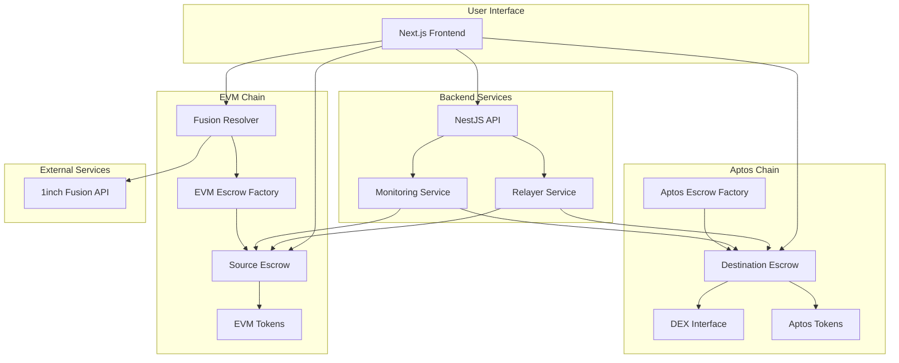

# AptosVAP: Cross-Chain Swap (EVM <-> Aptos)

A decentralized cross-chain swap platform that enables atomic token exchanges between EVM-compatible chains and the Aptos blockchain, leveraging 1inch Fusion for MEV protection and optimal pricing.

## System Architecture and Workflow

This project facilitates atomic cross-chain swaps by integrating 1inch Fusion with a Hashed Timelock Contract (HTLC) pattern, ensuring MEV-protected, gas-free swaps on the EVM side that are atomically settled on the Aptos chain.

### Core Components

#### Smart Contracts
- **EVM Contracts**
  - `EscrowSrc.sol`: Source escrow contract for cross-chain atomic swaps
  - `FusionResolver.sol`: Connects 1inch Fusion orders to the escrow system
  - `EscrowFactory.sol`: Factory contract for deploying escrow contracts
  - `BaseEscrow.sol`: Base contract with common escrow functionality
  - `Escrow.sol`: Core escrow implementation

#### Move Contracts
- **Aptos Contracts** (in `hackathon_clone` directory)
  - `EscrowDst.move`: Destination escrow contract for Aptos
  - `EscrowFactory.move`: Factory for creating escrow contracts on Aptos
  - `DexInterface.move`: Interface for DEX interactions on Aptos

#### Backend Services
- **NestJS Server**
  - API endpoints for swap management
  - Relayer service for cross-chain communication
  - Monitoring and event handling

#### Frontend Application
- **Next.js Web Interface**
  - User-friendly swap interface
  - Wallet connections for both EVM and Aptos
  - Swap status monitoring

#### Scripts & Tools
- Deployment scripts for all components
- Swap execution utilities
- Testing and monitoring tools

### System Architecture Diagram



### Swap Workflow (EVM to Aptos)

1. **Initiation**: User initiates swap through the frontend or CLI
2. **Secret Generation**: System generates a secure preimage and its hash
3. **Fusion Order**: Creates a 1inch Fusion order with FusionResolver as settlement
4. **EVM Lock**: FusionResolver executes the swap and deploys an EscrowSrc contract via EscrowFactory
5. **Cross-Chain Relay**: Relayer detects the EscrowSrc deployment event and creates Aptos EscrowDst contract
6. **Aptos Withdrawal**: User reveals preimage on Aptos EscrowDst to claim tokens
7. **EVM Settlement**: Relayer uses revealed preimage to complete the EVM side

## Project Structure

```
├── contracts/                # EVM smart contracts
│   └── escrow/               # Escrow contracts for cross-chain swaps
│       ├── BaseEscrow.sol    # Base contract with common escrow functionality
│       ├── Escrow.sol        # Core escrow implementation
│       ├── EscrowFactory.sol # Factory for deploying escrow contracts
│       ├── EscrowSrc.sol     # Source escrow for cross-chain atomic swaps
│       ├── FusionResolver.sol # Connects 1inch Fusion with escrow system
│       ├── interfaces/       # Contract interfaces
│       └── libraries/        # Utility libraries
│
├── aptos-contracts/          # Aptos Move contracts
│   ├── sources/              # Move contract sources
│   │   └── hackathon_clone/    # Aptos escrow implementation
│   │       ├── EscrowDst.move  # Destination escrow contract
│   │       ├── EscrowFactory.move # Factory for escrow contracts
│   │       └── DexInterface.move # Interface for DEX interactions
│   └── tests/                # Move contract tests
│
├── be/                       # Backend NestJS application
│   ├── src/                  # Backend source code
│   ├── prisma/               # Database schema and migrations
│   └── Dockerfile            # Backend container definition
│
├── fe/                       # Frontend Next.js application
│   ├── src/                  # Frontend source code
│   ├── public/               # Static assets
│   └── Dockerfile            # Frontend container definition
│
├── scripts/                  # Utility scripts
│   ├── deploy-*.js           # Deployment scripts
│   ├── swap-*.js             # Swap execution scripts
│   ├── check-*.js            # Monitoring scripts
│   └── fusion/               # 1inch Fusion integration scripts
│
└── test/                     # Test suite
```

## Prerequisites

- Node.js v16+
- Hardhat
- Aptos CLI
- Docker & Docker Compose (for local development)

## Setup

1. **Install dependencies:**
   ```shell
   npm install
   ```

2. **Create a `.env` file** from the example:
   ```shell
   cp .env.example .env
   ```
   *Update the `.env` file with your private keys and other required values.*

3. **Set up Aptos account:**
   ```shell
   aptos init --profile default --network devnet
   aptos account fund-with-faucet --account YOUR_APTOS_ADDRESS --amount 100000000000
   ```

## Available Commands

### Development Environment
- **`npm run start-evm-node`**: Starts a local Hardhat node
- **`npm run dev:be`**: Starts the backend in development mode
- **`npm run dev:fe`**: Starts the frontend in development mode

### Deployment
- **`npm run deploy:contracts`**: Deploys all EVM contracts
- **`npm run deploy:aptos`**: Compiles and publishes Aptos contracts
- **`npm run deploy:all`**: Deploys all components (EVM, Aptos, and services)

### Token Management
- **`npm run register-aptos-token`**: Registers the Aptos token for the user's account
- **`npm run mint-aptos-tokens`**: Mints new Aptos tokens for testing
- **`npm run check-aptos-balance`**: Checks the Aptos token balance
- **`npm run check-evm-balance`**: Checks the EVM token balance

### Cross-Chain Swaps
- **`npm run swap:evm-to-aptos`**: Initiates an EVM to Aptos swap
- **`npm run swap:aptos-to-evm`**: Initiates an Aptos to EVM swap
- **`npm run swap:fusion`**: Executes a swap using 1inch Fusion

### HTLC Management
- **`npm run create-evm-htlc`**: Creates an HTLC on the EVM chain
- **`npm run withdraw-evm-htlc`**: Withdraws funds from an EVM HTLC
- **`npm run create-aptos-htlc`**: Creates an HTLC on the Aptos chain
- **`npm run withdraw-aptos-htlc`**: Withdraws funds from an Aptos HTLC
- **`npm run list-aptos-htlcs`**: Lists all active HTLCs on the Aptos side

## Component Documentation

### Backend

The backend service provides API endpoints for managing cross-chain swaps and includes a relayer service that monitors events on both chains to facilitate the atomic swap process.

For detailed information on the backend, its setup, and API endpoints, please see the [backend README](./be/README.md).

### Frontend

The frontend application offers a user-friendly interface for initiating and monitoring cross-chain swaps. It connects to both EVM and Aptos wallets and interacts with the backend API.

For more information on the frontend, please see the [frontend README](./fe/README.md).

### Smart Contracts

The project uses smart contracts on both EVM and Aptos chains to implement the Hashed Timelock Contract (HTLC) pattern for atomic swaps.

#### EVM Contracts
- **EscrowSrc**: Source escrow contract that locks funds and releases them upon verification of a secret
- **FusionResolver**: Integrates with 1inch Fusion for MEV-protected swaps and deploys escrow contracts
- **EscrowFactory**: Creates minimal proxy clones of the escrow implementation
- **BaseEscrow**: Provides common functionality like time locks and security checks

#### Aptos Contracts
- **AtomicSwap**: Implements the HTLC pattern on Aptos
- **TestAptosToken**: A test token for Aptos

## Contributing

Contributions are welcome! Please feel free to submit a Pull Request.

## License

This project is licensed under the MIT License - see the LICENSE file for details.
